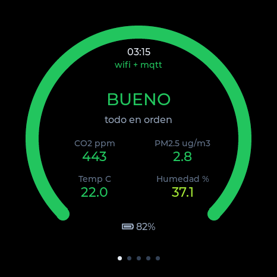
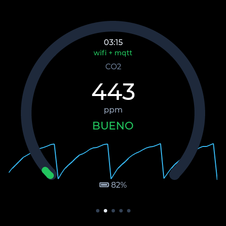
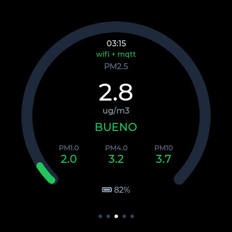
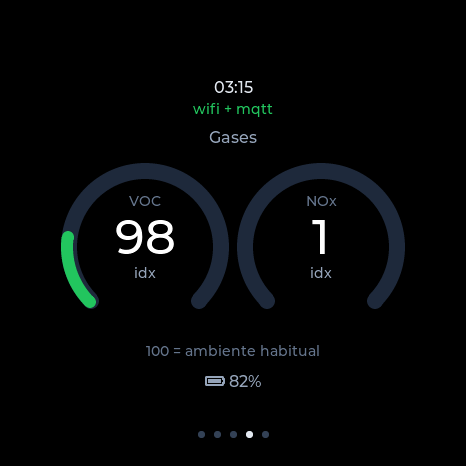
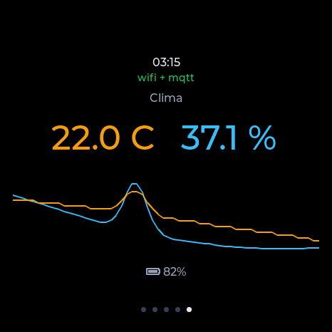
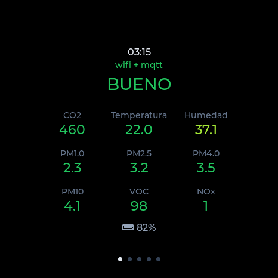

# AirRing — Monitor SEN66

**Carcasa imprimible en MakerWorld: [AirRing](https://makerworld.com/en/models/3199590-airring-air-quality-monitor-mqtt)**

Monitor de calidad del aire para la **Waveshare ESP32-S3-Touch-AMOLED-1.75**
(466×466 redonda) con un **Sensirion SEN66**, pantalla autónoma y
autodescubrimiento en **Home Assistant** por MQTT.

Inspirado en el [PowerDot Air](https://makerworld.com/es/models/3029930-powerdot-air-home-assistant-air-sensor)
de Scoolt96, que hace lo mismo sobre la Waveshare 1.46" LCD. Su
[firmware es cerrado](https://github.com/Scoolt96/PowerDot-fw) (el repo solo
publica los `.bin`), así que esto es una implementación nueva desde cero,
adaptada a la AMOLED redonda: driver CO5300 por QSPI, táctil CST9217, RTC
para el histórico y un simulador de escritorio para iterar la pantalla.

<p align="center">
  
</p>

## Qué hace

- Mide **nueve magnitudes** con un solo sensor: CO₂, PM1.0 / PM2.5 / PM4.0 /
  PM10, índice VOC, índice NOx, temperatura y humedad.
- **Cinco páginas** en una pantalla AMOLED redonda, más una vista de reposo
  que las muestra todas de un vistazo.
- **Aparece solo en Home Assistant** por MQTT autodiscovery, y funciona
  también con **HomeKit** vía Homebridge ([guía](docs/HOMEBRIDGE.md)).
- **Todo local**: ni nube, ni cuenta, ni telemetría. Sigue funcionando con la
  red caída — la pantalla es autónoma.
- **Panel web** para configurarlo y **actualizaciones por WiFi** (OTA).
- **Aviso sonoro** al pasar el umbral de CO₂, con histéresis.
- Funciona **con batería**, con un perfil de ahorro que se activa solo al
  desenchufar (~6 h medidas con una celda de 1000 mAh).
- La pantalla habla **español, inglés y alemán**.

| Resumen | CO₂ | Partículas |
|---|---|---|
|  |  |  |
| **Gases** | **Clima** | **Reposo** |
|  |  |  |

*(capturas del simulador incluido, que ejecuta la misma UI que el firmware)*

## Piezas

| Pieza | Notas |
|---|---|
| Waveshare ESP32-S3-Touch-AMOLED-1.75 | SKU 31261 (las variantes -B y -G también sirven) |
| Sensirion SEN66 | 3,3 V ±5 %, I2C, viene con cable JST GH de 6 hilos |
| 4 cables al header de 8 pines | 3V3, GND, SDA, SCL |
| 3 tornillos M2×6 | Sujetan la placa al aro del bisel |
| [Carcasa AirRing](https://makerworld.com/en/models/3199590-airring-air-quality-monitor-mqtt) | Imprimible, 0,24 mm de capa, 2 paredes, 15% de relleno |
| Cable USB-C | alimentación y flasheo |

## Cableado — leer antes de conectar

**El SEN66 responde en la dirección I2C `0x6B`, que es exactamente la misma
que el IMU QMI8658 que la placa lleva soldado.** No pueden compartir bus. Por
eso el sensor va en un **segundo bus I2C** (puerto 1) sobre GPIOs del header
de expansión, a 100 kHz (el máximo que admite el SEN66), mientras el bus de a
bordo (táctil, PMU, RTC, IMU, audio) sigue a 400 kHz. Ventaja de propina: el
sensor no compite con el táctil.

**El esquema completo está en [docs/CABLEADO.md](docs/CABLEADO.md).** Resumen:

Se cablea por la **etiqueta serigrafiada** del header, no por número de pin:

| SEN66 | Cable | → | Etiqueta en la placa |
|---|---|---|---|
| 1 VDD | rojo | → | **3V3** (¡no VBUS, que son 5 V!) |
| 2 GND | negro | → | **GND** |
| 3 SDA | verde | → | **IO17** |
| 4 SCL | amarillo | → | **IO18** |

Los cables azul y violeta (pines 5 y 6 del sensor) no se conectan. Ojo: el
orden real del header es `IO18 IO17 IO16 RXD TXD 3V3 GND VBUS` y **no** coincide
con la numeración 1..8 de la [referencia de hardware oficial](https://github.com/waveshareteam/ESP32-S3-Touch-AMOLED-1.75/blob/main/HARDWARE_REFERENCE.md).

Si se cablea de otra forma, no hace falta tocar nada a ciegas: al arrancar,
si el sensor no contesta en esos pines, el firmware **barre los pares
candidatos** del header y avisa por consola de cuál funciona:

```
W (1234) sen66: no responde en SDA=17 SCL=18, barriendo header
I (1500) sen66: producto: 'SEN66'
W (1500) sen66: encontrado en SDA=16 SCL=17 (no en los de board.h); fija esos valores en BOARD_SEN66_PIN_*
```

Se anota el par bueno en `board.h`, se recompila y listo. La comprobación no
se queda en el ACK de la dirección: lee el nombre de producto y exige que
empiece por `SEN6`, para no confundirse con otro chip.

El SEN66 tiene ventilador y **Sensirion avisa de picos de hasta 350 mA**.
Waveshare no especifica cuánta corriente da el 3V3 del header; en la práctica
el buck del AXP2101 va sobrado, pero conviene alimentar la placa con un
cargador USB-C de 1 A o más y no desde un puerto de hub. Si aparecen
reinicios por brownout, errores de CRC o `fan_error`, la causa es ésa y la
solución es una fuente de 3,3 V aparte para el sensor con GND común. Con
batería la autonomía será de horas, no de días.

## Compilar y flashear

Necesita **ESP-IDF 5.3 o superior** (probado con 5.5.2).

```bash
source ~/esp/esp-idf/export.sh
idf.py set-target esp32s3
idf.py build
idf.py -p /dev/cu.usbmodem1101 flash monitor
```

El gestor de componentes descarga solo LVGL 9, `esp_lvgl_port`,
`esp_lcd_co5300` y `esp_lcd_touch_cst9217`.

La tabla de particiones tiene **dos slots de app de 4 MB**, así que las
actualizaciones OTA desde el navegador funcionan desde el primer flasheo.

## Primer arranque

1. Sin red configurada, el aparato abre un punto de acceso abierto llamado
   **`SEN66-XXXXXX`** (la pantalla lo indica).
2. Conectarse y abrir **http://192.168.4.1**.
3. Rellenar WiFi y broker MQTT (`mqtt://192.168.1.10:1883`), guardar. El
   aparato se reinicia y se conecta.
4. A partir de ahí el panel web está en la IP que muestre la pantalla.

Si la contraseña del WiFi cambia y falla 8 veces seguidas, el portal se
vuelve a abrir solo sin perder la configuración: no hay que reflashear.

## Home Assistant

Hace falta un broker MQTT: cómo montarlo y cómo comprobar que el aparato
publica está en **[docs/MQTT.md](docs/MQTT.md)**. Con eso hecho:

1. En HA, Ajustes > Dispositivos y servicios > **Añadir integración > MQTT**,
   apuntando al broker con su usuario y contraseña.
2. Nada más. **No hay que tocar YAML.**

Al conectar, el firmware publica mensajes de descubrimiento retenidos en
`homeassistant/sensor/sen66-xxxxxx/<clave>/config` y HA crea **un dispositivo
con 11 entidades**: las nueve del sensor, el nivel global de calidad del aire
y la cobertura WiFi como diagnóstico.

- Estado: `sen66-xxxxxx/state`, un JSON cada 10 s.
- Disponibilidad: `sen66-xxxxxx/status` con *last will*, así que si el
  aparato se cae HA lo marca como no disponible en vez de dejar valores
  congelados.

Las clases de dispositivo van puestas (`carbon_dioxide`, `pm25`, `pm10`,
`temperature`, `humidity`…) para que las gráficas y las unidades salgan bien.
Los índices VOC/NOx no tienen clase porque en HA no existe: van con icono.

La entidad del nivel muestra el identificador tal cual —`good`, `fair`,
`moderate`, `poor`, `bad`— porque es lo que viaja por MQTT, sin traducir, para
que las automatizaciones no se rompan al cambiar el idioma de la pantalla. Si
lo quieres en castellano **en el panel, sin perder eso**, con una plantilla en
`configuration.yaml`:

```yaml
template:
  - sensor:
      - name: "Calidad del aire (texto)"
        state: >
          {{ {'good':'Bueno','fair':'Aceptable','moderate':'Regular',
              'poor':'Malo','bad':'Muy malo'}.get(
              states('sensor.monitor_sen66_calidad_del_aire'), 'Desconocido') }}
```

Para automatizar, usa el identificador y no el texto:

```yaml
trigger:
  - platform: numeric_state
    entity_id: sensor.monitor_sen66_co2
    above: 1200
```

### Histórico

Aquí hay un malentendido fácil. HA guarda **dos cosas distintas**:

- Las **estadísticas de larga duración**: una fila por hora con mínimo, máximo
  y media. **No se purgan nunca.** Salen solas en todas las métricas porque el
  firmware publica `state_class: measurement`. Las tendencias de meses ya las
  tienes sin tocar nada.
- El **detalle**, cada muestra tal cual llegó. Eso sí caduca, a los **10 días**
  por defecto.

O sea que subir la retención solo sirve para poder hacer zoom en un día
concreto de hace tiempo, no para ver la tendencia larga.

Si aun así lo quieres más largo, en `configuration.yaml`:

```yaml
recorder:
  purge_keep_days: 30
  commit_interval: 30
  exclude:
    entities:
      - sensor.monitor_sen66_wifi
```

El aparato publica cada 10 s y sus métricas cambian casi siempre, así que él
solo son unas **15.000 filas al día** (medido). Con 30 días la base de datos
se queda en torno a 80 MB. La cobertura WiFi va excluida porque son ~1.700
filas diarias de un diagnóstico que nadie mira en histórico; se sigue viendo
en vivo, simplemente no se guarda.

## HomeKit (sin Home Assistant)

Si en vez de HA quieres la app **Casa** de Apple y Siri, se hace con
Homebridge y `homebridge-mqttthing`: mismo broker
([docs/MQTT.md](docs/MQTT.md)), distinto oyente. Los accesorios listos para
pegar y las trampas del montaje están en
**[docs/HOMEBRIDGE.md](docs/HOMEBRIDGE.md)**.

En ese caso deja el **prefijo de descubrimiento vacío** en el panel del
aparato: el autodescubrimiento solo lo entiende HA.

## Idiomas

La pantalla habla **español, inglés y alemán**, y se elige en el panel web.

Las fuentes Montserrat de LVGL solo traen ASCII, así que el alemán necesita
`ÄÖÜäöüß`. En vez de regenerar las cinco fuentes enteras, hay una **fuente de
reserva** con solo esos siete glifos (`main/fonts/`, ~37 KB en total) que se
encadena con `lv_font_t.fallback`. Las Montserrat de LVGL son `const` y viven
en flash, así que la UI usa **copias en RAM** de ~30 bytes con el campo
`fallback` relleno (`main/fonts/fonts.c`).

El español se escribe **sin acentos** a propósito: "Particulas", "ug/m3".

El valor que va por MQTT **no se traduce**: es un identificador estable en
inglés (`good`, `fair`, `moderate`, `poor`, `bad`). Si cambiara con el idioma
de la pantalla, rompería las automatizaciones de Home Assistant.

## La pantalla

Cinco páginas, **se pasan arrastrando el dedo y no rotan solas**. Al no tocar
nada durante `screen_timeout_s` la pantalla se atenúa y muestra una **vista de
reposo con las nueve magnitudes** a la vez; al tocar vuelve exactamente a la
página donde estabas.

| Página | Contenido |
|---|---|
| Resumen | Anillo semáforo con el peor de los contaminantes y qué métrica manda |
| CO₂ | Valor grande, anillo 400–2400 ppm y gráfica de la última hora |
| Partículas | PM2.5 en grande con anillo; PM1.0 / PM4.0 / PM10 debajo |
| Gases | Índices VOC y NOx en dos anillos |
| Clima | Temperatura y humedad, y ambas curvas superpuestas con escala propia |

En AMOLED el negro es píxel apagado, así que el fondo negro no consume y el
atenuado por inactividad ahorra de verdad.

### Umbrales

Cinco niveles: **BUENO / ACEPTABLE / REGULAR / MALO / MUY MALO**.

| Métrica | Fronteras |
|---|---|
| CO₂ (ppm) | 800 · 1000 · 1400 · 2000 |
| PM1.0 y PM2.5 (µg/m³) | 10 · 20 · 25 · 50 |
| PM4.0 y PM10 (µg/m³) | 20 · 40 · 50 · 100 |
| Índice VOC | 150 · 250 · 400 · 450 |
| Índice NOx | 20 · 150 · 300 · 400 |

Temperatura y humedad no son contaminación: se clasifican por distancia al
rango de confort (19–25 °C, 40–60 %RH) y **no entran en el semáforo global**.

Los umbrales están en un único sitio, la tabla `k_bands` de
[`main/air.c`](main/air.c).

## Simulador de escritorio

Compila **la misma UI y la misma lógica** que el firmware contra SDL2, con
datos sintéticos (el CO₂ sube, alguien ventila cada 15 min, de vez en cuando
se cocina). Iterar la pantalla aquí es mucho más rápido que flashear.

```bash
brew install sdl2                      # una vez
idf.py build                           # una vez, para que baje LVGL
cd sim && cmake -B build -DCMAKE_BUILD_TYPE=Release && cmake --build build -j
./build/sen66_sim
```

Opciones útiles:

```bash
./build/sen66_sim --lang de            # en aleman
./build/sen66_sim --page 2             # abre en una pagina concreta
./build/sen66_sim --scenario bad       # aire malo
./build/sen66_sim --warp 60             # el tiempo corre 60x
./build/sen66_sim --offset 2400         # adelanta la fase del ciclo
./build/sen66_sim --shots /tmp/caps 5   # 5 capturas BMP y sale
```

## Ajustes (panel web)

Red y MQTT, nombre en HA, idioma, zona horaria y NTP, brillo normal y
atenuado, tiempo hasta atenuar, segundos por página, páginas visibles
(máscara de bits), ventana de las gráficas, corrección de temperatura,
altitud, autocalibración del CO₂ y el **aviso sonoro**: activarlo, el umbral
al que salta, el umbral al que se calla y el volumen.

Los dos umbrales del aviso no son el mismo número a propósito. Salta al
subir de `alarm_co2_ppm` y no se calla hasta bajar de `alarm_clear_ppm`, y
esa diferencia es lo que evita que pite sin parar cuando el CO₂ se queda
rondando el límite. Si guardas el de callar por encima del de avisar, el
panel lo baja solo y lo dice en el log.

Al guardar, **el aparato se reinicia**: es la forma limpia de aplicar de una
vez la red, el MQTT, las páginas y los ajustes del propio sensor, sin quedarse
a medias. El brillo sí se aplica al instante.

También hay botones para **limpiar el ventilador** del sensor, para **probar
el altavoz** y para **subir un `.bin`** y actualizar por OTA. La limpieza
además se lanza **sola una vez por semana**, que es lo que recomienda
Sensirion; la fecha de la última se guarda en NVS para que reiniciar no
reinicie la cuenta.

### Recalibrar el CO₂

En Mantenimiento hay un botón para forzar la calibración del CO₂ contra una
referencia conocida. **Solo tiene sentido con una referencia de verdad**: el
aire libre son unos 420 ppm, así que se saca el aparato fuera, lejos de
personas, se deja medir cinco minutos y se recalibra a 420. Con un número
inventado se estropea la medida en vez de arreglarla, **y queda guardado en
la EEPROM del sensor**.

No suele hacer falta: la autocalibración automática está activada y se ajusta
sola si el aparato ve aire fresco de vez en cuando.

Por dentro, el panel solo *pide* la recalibración; quien la ejecuta es la
tarea del sensor, porque el comando exige la medición parada y hacer el
stop/start desde el hilo del servidor chocaría con la lectura de cada
segundo. El aprendizaje del VOC se guarda antes de parar y se devuelve
después, para no tirar días de aprendizaje por una recalibración. El
resultado (la corrección aplicada, en ppm) aparece en el propio panel.

### Sobre la seguridad del panel

**El panel web no tiene contraseña, y es a propósito.** Cualquiera en tu red
local puede cambiar los ajustes, reiniciarlo y **subirle firmware por
`/api/ota`**. Para un aparato doméstico en una red de confianza es un
compromiso razonable —y hace que actualizarlo sea trivial—, pero conviene
saberlo: si tu WiFi tiene invitados o cacharros poco fiables, esto es una
puerta abierta.

## Puesta a punto del sensor

- **Los índices VOC y NOx necesitan tiempo.** Son índices adaptativos: el
  sensor aprende el ambiente habitual y lo sitúa en 100 (VOC) y 1 (NOx). Las
  primeras horas los valores no significan gran cosa.
- **La temperatura leerá alto**, porque el sensor está dentro de una carcasa
  junto a electrónica que calienta. Se compara con un termómetro de referencia
  y se mete la diferencia en "Corrección de temperatura": el offset se programa
  **dentro del SEN66**, así que corrige también la humedad relativa.

  Pero antes de aplicar nada, léete [Sobre medir el
  desvío](#sobre-medir-el-desvío): es fácil corregir de más.
- **Altitud**: afecta a la medida de CO₂. Poner los metros del sitio.
- **Autocalibración del CO₂ (ASC)**: activada por defecto. Asume que el
  aparato ve aire fresco (~400 ppm) de forma regular. En una habitación que
  nunca se ventila conviene desactivarla y hacer una recalibración forzada al
  aire libre.

### Sobre medir el desvío

Aquí van 22 horas de medidas reales contra un Qingping Air Monitor 2 y un
termómetro independiente, los tres juntos en la misma mesa. Sirven de aviso,
porque cada paso del camino invitaba a corregir algo que no había que corregir.

**Dos aparatos dan la diferencia, nunca quién acierta.** Doce horas contra el
Qingping daban +1,05 °C y −8,4 % de humedad, muy constantes, y la conclusión
obvia era meter −1,1 °C. Un tercer termómetro entre los dos lo desmontó:
marcaba 26,1 °C y 56 %, o sea el SEN66 a **+0,4 °C** y el Qingping a −0,4 °C.
El descuadre de humedad era **del Qingping** (+8,9 %), no del SEN66. Alinear
uno con otro solo habría propagado el error del que se toma como patrón.

**Un día entero, no unas horas.** Esa diferencia de temperatura tan estable lo
era porque solo había datos diurnos. Con el ciclo completo va de **+0,20 a
+1,30 °C**: de madrugada se estrecha porque el otro aparato se calienta y el
SEN66 no. Varía tanto como valdría la corrección, así que un offset fijo
acierta a una hora y falla a otra.

**Comprobar a varias concentraciones.** De tarde el SEN66 marcaba 44 ppm menos
de CO₂ que el Qingping y parecía un error claro. Con la noche entera se ve que
no es un desplazamiento sino **pendiente**:

| CO₂ (Qingping) | SEN66 | diferencia |
|---|---|---|
| 451 | 407 | −44 |
| 545 | 517 | −28 |
| 645 | 627 | −18 |
| 731 | 752 | +22 |
| 811 | 836 | +24 |

`SEN66 = 1,20 × Qingping − 138`, y **se cruzan en 675 ppm**. Ninguno de los dos
está "mal": tienen ganancias distintas y coinciden en el punto de cruce. Con
datos de un solo tramo, cualquiera de los dos parece el equivocado.

**No confundir un sensor bien calibrado con uno anclado.** El SEN66 pasó cinco
horas de tarde clavado en 403 ppm, que es sospechosamente la línea base del
aire exterior, y parecía que la autocalibración le había fijado el cero
demasiado abajo. La curva nocturna lo aclaró: 403 → 500 → 642 → 720 → **831 al
amanecer**, la subida de manual de un cuarto cerrado con gente durmiendo. La
tarde estaba ventilada de verdad y el sensor la siguió.

**Conclusión: en este aparato no se aplica ningún offset.** Los +0,4 °C contra
la referencia caben dentro de la tolerancia del propio SEN66 (±0,5 °C), y la
diferencia ni siquiera es constante. Corregir eso sería ajustar a ruido, con el
agravante de que un offset se olvida y se queda ahí para siempre.

## Estructura

```
main/
  app_main.c      orden de arranque, tareas y reloj
  board.h         pinout verificado de la placa (no re-derivar)
  display.c       CO5300 por QSPI + CST9217 + port de LVGL
  sen66.c         driver I2C del sensor (bus propio, CRC-8, autodetección)
  air.c           lógica pura: métricas, umbrales, niveles, colores
  history.c       histórico circular de 24 h en PSRAM
  ui.c            las cinco páginas (solo LVGL, sin ESP-IDF)
  net.c           WiFi estación + portal + SNTP
  ha_mqtt.c       autodescubrimiento y publicación
  webcfg.c        servidor web, API JSON y OTA
  settings.c      persistencia en NVS
  rtc_pcf85063.c  RTC (hora real sin red)
sim/              simulador SDL2 que reutiliza air.c, history.c y ui.c
```

`air.c`, `history.c` y `ui.c` no incluyen nada de ESP-IDF: es lo que permite
compilarlos igual en el PC.

## Estado

Compila limpio (ESP-IDF 5.5.2, 1,5 MB, sin warnings) y la UI está verificada
en el simulador página a página. **Todavía no se ha probado contra hardware
real** — el SEN66 está de camino. Al montarlo queda por ajustar la rotación
de pantalla `BOARD_LCD_ROTATION` según cómo quede el USB-C en la carcasa.

## Licencia

**[PolyForm Noncommercial 1.0.0](LICENSE).** Puedes usarlo, modificarlo y
compartirlo libremente **para cualquier fin no comercial**: uso personal,
investigación, docencia, organizaciones sin ánimo de lucro. Lo que no puedes
es venderlo ni usarlo dentro de un producto o servicio de pago.

Conviene decirlo claro: **esto no es software libre** en el sentido de la OSI,
precisamente porque restringe el uso comercial. Es una decisión deliberada.
Si quieres usarlo comercialmente, escribe y lo hablamos.

Y sin garantía de ninguna clase: es un proyecto doméstico, **no un instrumento
de medida certificado**. No lo uses para nada donde la salud de alguien
dependa del número que muestre.

### Lo que no cubre esa licencia

- Las **fuentes** de `main/fonts/` derivan de Montserrat y siguen bajo
  [SIL OFL 1.1](main/fonts/NOTICE.md).
- Las **dependencias** (ESP-IDF, LVGL, los componentes de Espressif y
  Waveshare) mantienen las suyas, que son permisivas.
- Si algún día hay **modelo 3D** para imprimir, irá con su propia licencia:
  Creative Commons desaconseja expresamente sus licencias para software, y
  al revés PolyForm no está pensada para objetos físicos.

## Agradecimientos

- **[PowerDot Air](https://makerworld.com/es/models/3029930-powerdot-air-home-assistant-air-sensor)**
  de Scoolt96, sobre la Waveshare 1.46" LCD, del que salió la idea. Su
  firmware es cerrado, así que aquí no hay una línea suya: esto es una
  implementación propia para otra pantalla.
- **Sensirion**, por publicar sus drivers con documentación de verdad. El
  protocolo del SEN66 de este firmware está verificado contra
  [raspberry-pi-i2c-sen66](https://github.com/Sensirion/raspberry-pi-i2c-sen66).
- **Espressif**, por ESP-IDF y por el componente
  [es8311](https://components.espressif.com/components/espressif/es8311), del
  que se copió la secuencia de registros del códec de audio (usa la API
  antigua de I2C, así que aquí va reescrita sobre la nueva).
- **Waveshare**, por publicar la
  [referencia de hardware](https://github.com/waveshareteam/ESP32-S3-Touch-AMOLED-1.75)
  de la placa. Ojo: el orden de pines del header que da NO coincide con la
  serigrafía; manda el cobre.
